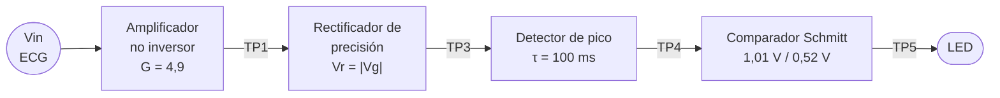
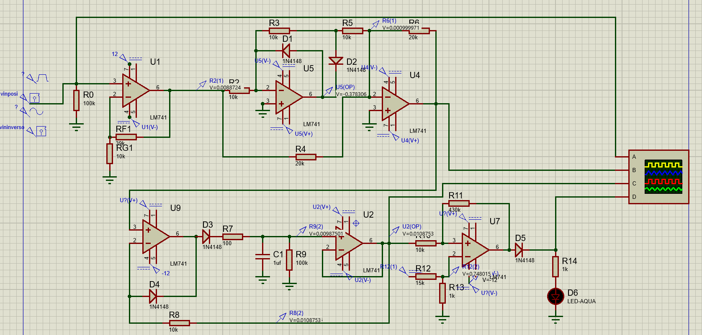
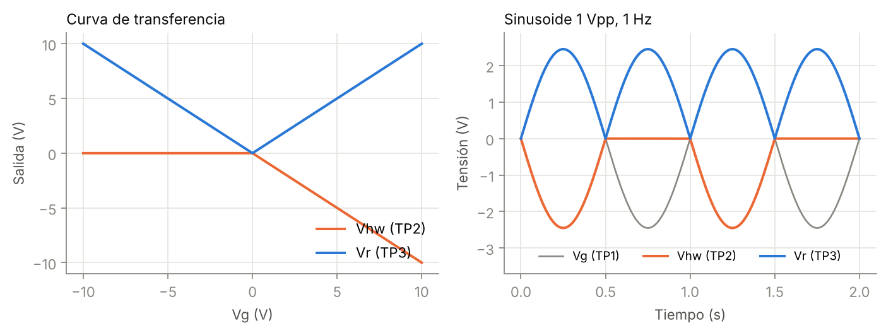
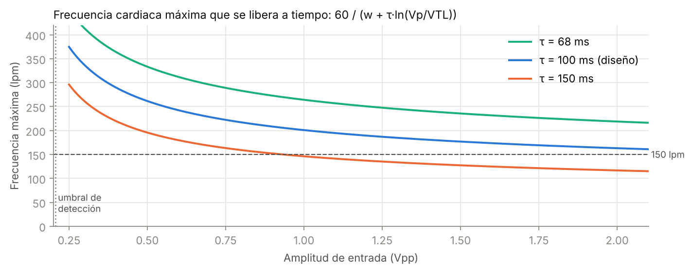
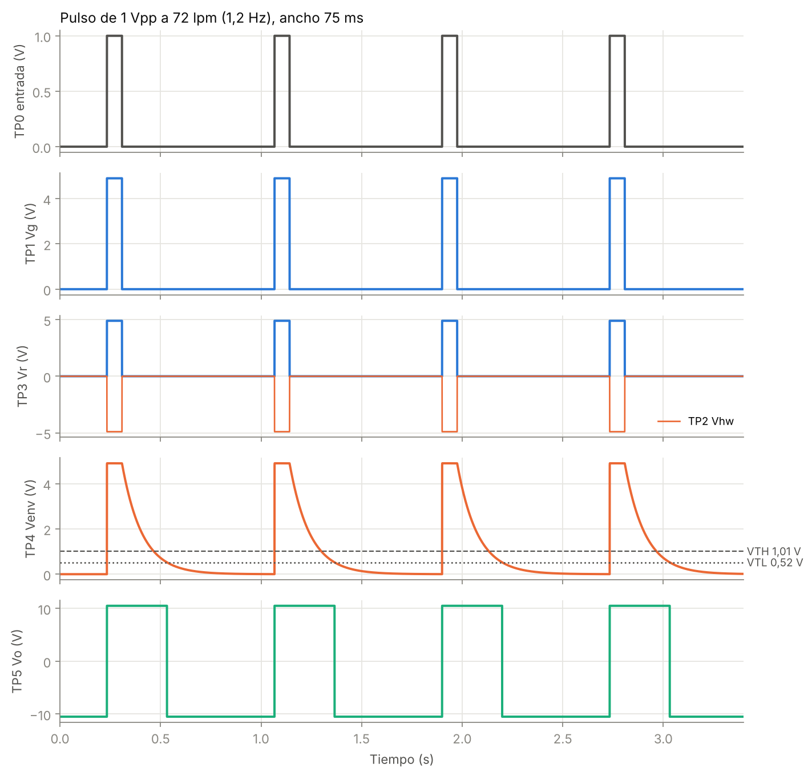
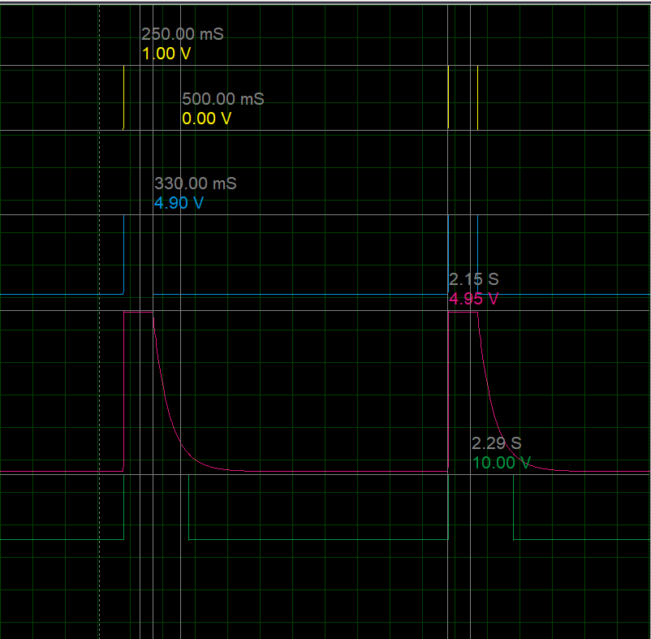
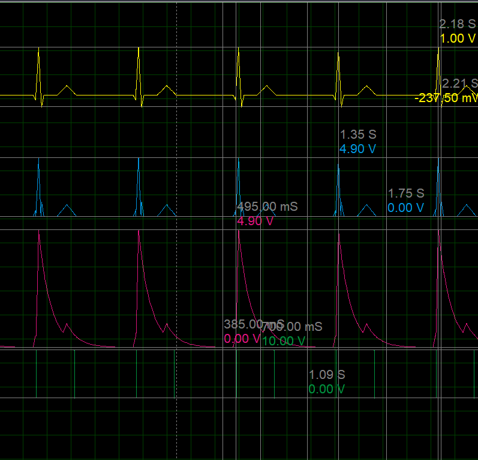

# Detector de latido ECG con amplificadores operacionales


Circuito analógico que detecta cada complejo QRS de una señal tipo ECG y entrega **un pulso rectangular limpio por latido**, sin importar la polaridad de la onda R. Usa seis amplificadores operacionales a ±12 V y tres bloques no lineales: un rectificador de precisión, un detector de pico y un comparador Schmitt.

> Proyecto del Laboratorio de Circuitos No Lineales, Ingeniería Electrónica, Universidad de Ibagué.
> Docente: Ing. Rodolfo José Gutiérrez González.

📄 **[Informe completo (PDF)](informe/Informe_Detector_Latido_ECG.pdf)** · 📊 **[Presentación (PDF)](presentacion/Presentacion_Detector_Latido_ECG.pdf)**

---

## Planteamiento del problema

Diseñar e implementar un detector de latido cardiaco basado en amplificadores operacionales alimentados a ±12 V, capaz de identificar cada complejo QRS de una señal tipo ECG de 0,5 a 2 Vpp ideal, sin importar su polaridad o tipo de señal, entregando un pulso rectangular limpio por cada latido en un rango de 40 a 150 latidos por minuto.

## Diagrama de bloques



## Circuito



| Etapa | Op-amps | Función | Valores clave |
|---|---|---|---|
| 1. Amplificador no inversor | U1 | Lleva la señal al rango útil sin saturar | Rf1 = 39 kΩ, Rg1 = 10 kΩ → **G = 4,9** |
| 2. Rectificador de onda completa | U2 + U3 | Elimina la dependencia de la polaridad | Media onda + sumador → **Vr = \|Vg\|** |
| 3. Detector de pico | U4 + U5 | Funde los lóbulos del QRS en un solo evento | R9 = 100 kΩ, C1 = 1 µF → **τ = 100 ms** |
| 4. Comparador Schmitt | U6 | Convierte la envolvente en un pulso limpio | k = 10k/430k, Vref = 0,75 V → **VTH = 1,01 V, VTL = 0,52 V** |
| 5. Indicador | — | Muestra cada latido | R14 = 1 kΩ → **I_LED ≈ 7,8 mA** |

## Ecuaciones de diseño

- **Ganancia** (límite por saturación): $G \le V_{sat}/V_{in,max} = 10{,}5/2 = 5{,}25$ → se elige $G = 1 + R_{f1}/R_{g1} = 4{,}9$
- **Rectificador + sumador**: $V_r = -(V_g + 2V_{hw}) = |V_g|$
- **Umbrales del Schmitt**: $V_{TH,TL} = V_{ref}(1+k) \pm V_{sat}\,k$, con $k = R_{10}/R_{11}$
- **Frecuencia cardiaca máxima**: $FC_{max} = \dfrac{60}{w + \tau \ln(V_p/V_{TL})}$ → 262 / 201 / 163 lpm para 0,5 / 1 / 2 Vpp

| Transferencia del rectificador | Frecuencia máxima vs. amplitud |
|---|---|
|  |  |

## Resultados

Respuesta de todas las etapas a un pulso tipo QRS (simulación por comportamiento):



| Medición (Proteus, pulso 1 V a 0,5 Hz) | Calculado | Simulado |
|---|---|---|
| Pico de Vr | 4,90 V | 4,90 V |
| Ancho del pulso de salida | 405 ms | 400 ms |
| Error máximo | — | ≤ 1,6 % |

- Detecta **todos los latidos de 40 a 150 lpm** con onda R positiva y negativa.
- Con 2 Vpp falla a partir de ~163 lpm, tal como predice la ecuación de $FC_{max}$.
- Con sinusoide da **2 pulsos por ciclo**, uno por semiciclo, como se espera de un rectificador de onda completa.

| Pulso de prueba en Proteus | Latido sintético en Proteus |
|---|---|
|  |  |

## Estructura del repositorio

```
├── informe/          Informe en LaTeX (main.tex, esquema.tex, figuras/) y PDF compilado
├── simulacion/       Simulación por comportamiento en Python (sim.py)
├── proteus/          Señales de latido sintético para el generador File de Proteus
├── presentacion/     Diapositivas de la exposición (PPTX y PDF)
└── docs/img/         Imágenes usadas en este README
```

## Cómo reproducir

**Simulación en Python**
```bash
cd simulacion
pip install -r requirements.txt
python sim.py        # genera las 7 gráficas en simulacion/fig/
```

**Informe en LaTeX:** compilar `informe/main.tex` con pdflatex (dos veces, para el índice) o subir la carpeta `informe/` junto con `simulacion/` a Overleaf.

**Proteus:** cargar `proteus/ecg_latido_positivo.txt` o `ecg_latido_invertido.txt` en un generador *File* conectado a la entrada.

## Autor

**Brahiam Alberto Campiño Romero**, estudiante de Ingeniería Electrónica, Universidad de Ibagué.
